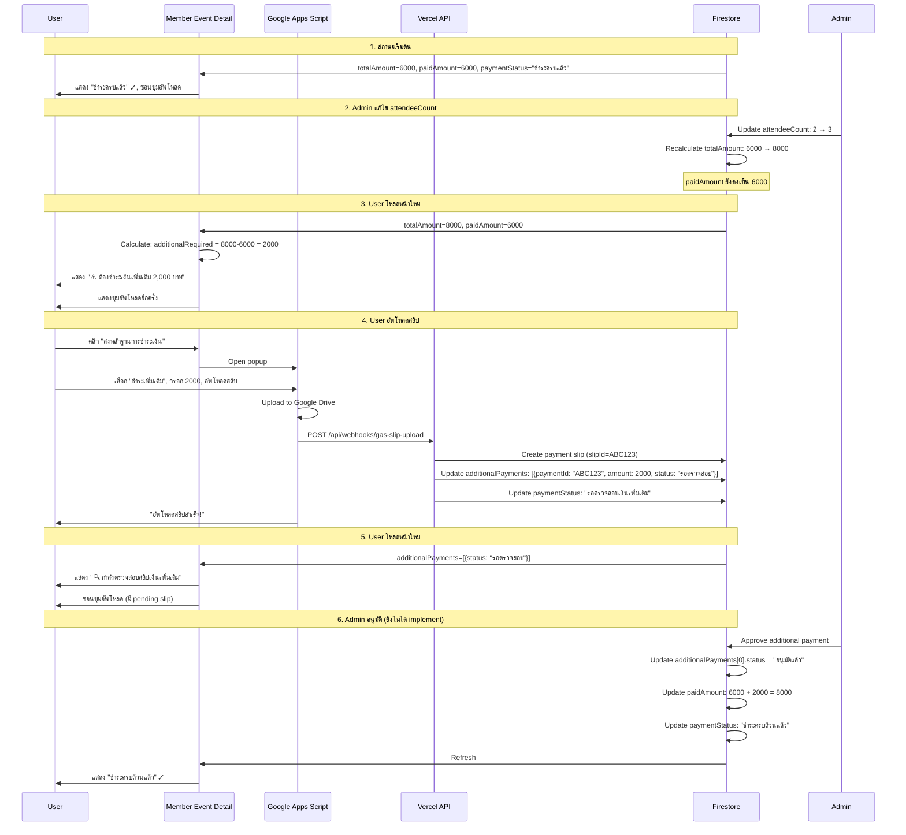

# Additional Payment Implementation Guide

## 📋 ภาพรวมของระบบ

ระบบติดตามการชำระเงินเพิ่มเติม (Additional Payment Tracking System) ถูกออกแบบมาเพื่อจัดการกรณีที่ admin แก้ไขจำนวนผู้เข้าร่วม (attendeeCount) หลังจากที่ user ชำระเงินและได้รับการอนุมัติแล้ว

### สถานการณ์หลัก

1. **ยอดเพิ่มขึ้น** → ต้องชำระเงินเพิ่ม (Additional Payment Required)
2. **ยอดลดลง** → ไม่ต้องทำอะไร (ไม่คืนเงินอัตโนมัติ)
3. **ยอดเท่าเดิม** → ไม่มีการเปลี่ยนแปลง

---

## 🏗️ สถาปัตยกรรมระบบ

### 1. Data Model

#### EventRegistration Fields ที่เพิ่มใหม่

```typescript
interface EventRegistration {
  // ... existing fields

  // Payment Tracking (New - for additional payments)
  paidAmount?: number;              // ยอดที่ชำระไปแล้วทั้งหมด
  additionalPayments?: string;      // JSON stringified AdditionalPayment[]
}
```

#### AdditionalPayment Interface

```typescript
interface AdditionalPayment {
  paymentId: string;             // Unique ID (ใช้ slipId จาก payment_slips)
  amount: number;                // ยอดเงินที่ชำระเพิ่ม
  reason: string;                // เหตุผล เช่น "เพิ่มจำนวนผู้เข้าร่วมจาก 2 เป็น 3 คน"
  slipUrl?: string;              // URL ของสลิป (Google Drive)
  uploadedAt?: string;           // ISO timestamp เมื่ออัพโหลด
  approvedAt?: string;           // ISO timestamp เมื่ออนุมัติ
  approvedBy?: string;           // Admin user ID ที่อนุมัติ
  rejectedAt?: string;           // ISO timestamp เมื่อปฏิเสธ
  rejectedBy?: string;           // Admin user ID ที่ปฏิเสธ
  rejectionReason?: string;      // เหตุผลที่ปฏิเสธ
  status: 'รอชำระ' | 'รอตรวจสอบ' | 'อนุมัติแล้ว' | 'ปฏิเสธ';
}
```

### 2. Payment Status Types ที่เพิ่มใหม่

```typescript
type PaymentStatus =
  // ... existing statuses

  // Additional payment statuses
  | 'รอชำระเงินเพิ่มเติม'    // Awaiting additional payment
  | 'รอตรวจสอบเงินเพิ่มเติม' // Additional payment slip uploaded
  | 'ชำระครบถ้วนแล้ว'       // Fully paid including additional payments
```

---

## 💻 Implementation Details

### 1. Helper Functions (`src/lib/payment-status.ts`)

#### `parseAdditionalPayments()`
แปลง JSON string → AdditionalPayment array

```typescript
export function parseAdditionalPayments(additionalPaymentsJson?: string): AdditionalPayment[] {
  if (!additionalPaymentsJson) return [];

  try {
    const parsed = JSON.parse(additionalPaymentsJson);
    return Array.isArray(parsed) ? parsed : [];
  } catch (error) {
    console.error('Error parsing additional payments:', error);
    return [];
  }
}
```

#### `calculateAdditionalPaymentRequired()`
คำนวณยอดที่ต้องชำระเพิ่ม

```typescript
export function calculateAdditionalPaymentRequired(
  totalAmount: number,
  paidAmount: number = 0,
  additionalPayments: AdditionalPayment[] = []
): number {
  // รวมเฉพาะ additional payments ที่อนุมัติแล้ว
  const approvedAdditional = additionalPayments
    .filter(p => p.status === 'อนุมัติแล้ว')
    .reduce((sum, p) => sum + p.amount, 0);

  // คำนวณยอดที่ยังไม่ได้ชำระ
  const unpaid = totalAmount - (paidAmount + approvedAdditional);

  return Math.max(0, unpaid);
}
```

#### `isFullyPaid()`
เช็คว่าชำระครบแล้วหรือไม่

```typescript
export function isFullyPaid(
  totalAmount: number,
  paidAmount: number = 0,
  additionalPayments: AdditionalPayment[] = []
): boolean {
  return calculateAdditionalPaymentRequired(totalAmount, paidAmount, additionalPayments) === 0;
}
```

---

### 2. Member Event Detail UI (`src/app/events/[eventId]/page.tsx`)

#### 2.1 แสดงประวัติการชำระเพิ่มเติม

```tsx
{/* Additional Payments Display */}
{additionalPayments.map((payment) => (
  <div key={payment.paymentId} className="bg-orange-50 border border-orange-200 rounded-lg p-3">
    <div className="flex items-start gap-2">
      {/* File Icon */}
      <svg className="w-5 h-5 text-orange-600">...</svg>

      <div className="flex-1">
        {/* Slip URL Link */}
        <button onClick={() => openLightbox(payment.slipUrl)}>
          {decodeURIComponent(fileName)}
        </button>

        {/* Badges: Payment Type + Amount + Status */}
        <div className="flex items-center gap-2 mt-1">
          <span className="badge-orange">ชำระเพิ่มเติม</span>
          <span className="font-semibold">{payment.amount.toLocaleString()} บาท</span>
          <span className={getStatusBadgeClass(payment.status)}>
            {payment.status}
          </span>
        </div>

        {/* Reason */}
        {payment.reason && <p className="text-xs mt-1">{payment.reason}</p>}

        {/* Upload Date */}
        {payment.uploadedAt && <p className="text-xs mt-1">อัปโหลดเมื่อ: {formatDate(payment.uploadedAt)}</p>}
      </div>
    </div>
  </div>
))}
```

#### 2.2 แสดง Notice เมื่อต้องชำระเพิ่ม

```tsx
{/* Additional Payment Required Notice */}
{additionalRequired > 0 && !hasPendingAdditional && (
  <div className="bg-orange-50 border-2 border-orange-300 rounded-lg p-4 mb-4">
    <div className="flex items-start gap-3">
      <svg className="w-6 h-6 text-orange-600">...</svg>
      <div className="flex-1">
        <h4 className="font-semibold text-orange-900 mb-2">
          ⚠️ ต้องชำระเงินเพิ่มเติม
        </h4>
        <div className="space-y-1 text-sm">
          <div className="flex justify-between">
            <span>ยอดทั้งหมด:</span>
            <span className="font-semibold">{totalAmount.toLocaleString()} บาท</span>
          </div>
          <div className="flex justify-between">
            <span>ชำระแล้ว:</span>
            <span className="font-semibold">{(paidAmount + approvedAdditional).toLocaleString()} บาท</span>
          </div>
          <div className="flex justify-between border-t pt-1 mt-1">
            <span className="font-bold">ต้องชำระเพิ่ม:</span>
            <span className="font-bold text-lg text-orange-600">
              {additionalRequired.toLocaleString()} บาท
            </span>
          </div>
        </div>
        <p className="text-xs text-orange-700 mt-2">
          กรุณาชำระเงินเพิ่มเติมและส่งสลิปผ่านปุ่มด้านล่าง
        </p>
      </div>
    </div>
  </div>
)}
```

#### 2.3 Logic การแสดง/ซ่อนปุ่มอัพโหลด

```typescript
// คำนวณว่าต้องแสดงปุ่มอัพโหลดหรือไม่
const shouldShowUploadButton = (() => {
  const hasPaymentAccount = !!event.paymentAccountNumber;
  const hasTotalAmount = userRegistration.totalAmount > 0;

  // คำนวณยอดที่ต้องชำระเพิ่ม
  const totalAmount = userRegistration.totalAmount || 0;
  const paidAmount = userRegistration.paidAmount || 0;
  const additionalPayments = parseAdditionalPayments(userRegistration.additionalPayments);

  const approvedAdditional = additionalPayments
    .filter(p => p.status === 'อนุมัติแล้ว')
    .reduce((sum, p) => sum + p.amount, 0);

  const additionalRequired = Math.max(0, totalAmount - (paidAmount + approvedAdditional));

  // เช็คว่ามี additional payment ที่รอตรวจสอบอยู่หรือไม่
  const hasPendingAdditional = additionalPayments.some(p => p.status === 'รอตรวจสอบ');

  // ซ่อนปุ่มถ้าชำระครบแล้ว
  if (additionalRequired === 0 && !hasPendingAdditional && paidAmount > 0) {
    return false;
  }

  // Full Payment Mode
  if (event.paymentMode !== 'deposit') {
    const hasFullPaymentSlip = !!(userRegistration.remainingSlipUrl || userRegistration.slipUrl);
    if (hasFullPaymentSlip && additionalRequired === 0 && !hasPendingAdditional) {
      return false;
    }
    return hasPaymentAccount && hasTotalAmount;
  }

  // Deposit Mode
  const notPaidDeposit = !userRegistration.depositPaid && !userRegistration.depositSlipUrl;
  const hasRemainingUnpaid = userRegistration.depositPaid &&
                             userRegistration.remainingAmount > 0 &&
                             !userRegistration.remainingSlipUrl;
  const needsAdditional = additionalRequired > 0 && !hasPendingAdditional;

  return hasPaymentAccount && hasTotalAmount && (notPaidDeposit || hasRemainingUnpaid || needsAdditional);
})();
```

---

### 3. GAS Webhook (`src/app/api/webhooks/gas-slip-upload/route.ts`)

#### 3.1 Handle Additional Payment Upload

```typescript
// ใน route handler
if (paymentType === 'additional') {
  // 1. ดึง additionalPayments เดิม
  const currentData = registrationDoc.data();
  let additionalPayments: AdditionalPayment[] = [];

  if (currentData.additionalPayments) {
    try {
      additionalPayments = JSON.parse(currentData.additionalPayments);
      if (!Array.isArray(additionalPayments)) {
        additionalPayments = [];
      }
    } catch (error) {
      console.error('Error parsing additionalPayments:', error);
      additionalPayments = [];
    }
  }

  // 2. สร้าง record ใหม่
  const newPayment: AdditionalPayment = {
    paymentId: slip.slipId,
    amount: Number(paymentAmount),
    reason: description || 'การชำระเงินเพิ่มเติม',
    slipUrl: slipUrl,
    uploadedAt: uploadedAt || new Date().toISOString(),
    status: 'รอตรวจสอบ',
  };

  additionalPayments.push(newPayment);

  // 3. บันทึกกลับเข้า Firestore
  updateData.additionalPayments = JSON.stringify(additionalPayments);
  updateData.paymentStatus = 'รอตรวจสอบเงินเพิ่มเติม';
}
```

---

### 4. GAS Upload Form (`gas-upload-slip/UploadForm.html`)

Form รองรับ "ชำระเพิ่มเติม" อยู่แล้ว:

```html
<select id="paymentType" onchange="handlePaymentTypeChange()">
  <option value="">-- เลือกประเภท --</option>

  <!-- Deposit Mode -->
  <? if (hasDepositMode) { ?>
    <option value="deposit">งวดที่ 1: ชำระมัดจำ (<?= depositAmount.toLocaleString() ?> บาท)</option>
    <option value="remaining">งวดที่ 2: ชำระยอดคงเหลือ (<?= remainingAmount.toLocaleString() ?> บาท)</option>
  <? } else { ?>
    <option value="full">ชำระเต็มจำนวน (<?= totalAmount.toLocaleString() ?> บาท)</option>
  <? } ?>

  <!-- Additional Payment (สำหรับทุก mode) -->
  <option value="additional">ชำระเพิ่มเติม (ระบุจำนวนเงิน)</option>
</select>

<!-- Amount Input (แสดงเมื่อเลือก "additional") -->
<div id="amountGroup" style="display: none;">
  <label for="amount">💰 จำนวนเงิน (บาท)</label>
  <input type="number" id="amount" min="1" step="0.01" placeholder="กรอกจำนวนเงิน">
  <p style="font-size: 12px; color: #718096; margin-top: 4px;">
    สำหรับการชำระเพิ่มเติม เช่น ค่าใช้จ่ายพิเศษ หรือการเปลี่ยนแปลงจำนวนผู้เข้าร่วม
  </p>
</div>
```

JavaScript:

```javascript
function handlePaymentTypeChange() {
  const paymentType = document.getElementById('paymentType').value;
  const amountGroup = document.getElementById('amountGroup');
  const amountInput = document.getElementById('amount');

  if (paymentType === 'additional') {
    amountGroup.style.display = 'block';
    amountInput.required = true;
    amountInput.value = '';
  } else {
    amountGroup.style.display = 'none';
    amountInput.required = false;
    // Auto-fill amount based on payment type
    if (PAYMENT_AMOUNTS[paymentType]) {
      amountInput.value = PAYMENT_AMOUNTS[paymentType];
    }
  }
}
```

---

## 🔄 User Flow

### Scenario: Admin เพิ่มจำนวนผู้เข้าร่วมจาก 2 → 3 คน



---

## 📊 Database Schema

### Firestore Collection: `eventRegistrations`

```typescript
{
  registrationId: "REG-20260713-001",
  eventId: "rally-2026",
  attendeeCount: 3,  // แก้จาก 2 → 3

  // Original Payment Data
  totalAmount: 8000,  // คำนวณใหม่จาก attendeeCount
  depositAmount: 4000,
  remainingAmount: 4000,
  depositPaid: true,
  depositPaidDate: "2026-07-10",
  depositSlipUrl: "https://drive.google.com/...",
  remainingSlipUrl: "https://drive.google.com/...",
  remainingPaidDate: "2026-07-12",

  // Payment Tracking (New)
  paidAmount: 6000,  // ยอดที่ชำระไปแล้ว (deposit 3000 + remaining 3000)
  additionalPayments: JSON.stringify([
    {
      paymentId: "ABC123",
      amount: 2000,
      reason: "เพิ่มจำนวนผู้เข้าร่วมจาก 2 เป็น 3 คน",
      slipUrl: "https://drive.google.com/thumbnail?id=...",
      uploadedAt: "2026-07-13T10:30:00Z",
      status: "รอตรวจสอบ"
    }
  ]),

  // Status Fields
  status: "รอดำเนินการ",  // Registration status (admin controlled)
  paymentStatus: "รอตรวจสอบเงินเพิ่มเติม",  // Payment status (system controlled)

  updatedAt: "2026-07-13T10:30:00Z"
}
```

### Firestore Collection: `payment_slips`

```typescript
{
  slipId: "ABC123",
  registrationId: "REG-20260713-001",
  eventId: "rally-2026",
  paymentType: "additional",
  amount: 2000,
  description: "ชำระเพิ่มเติม",
  slipUrl: "https://drive.google.com/thumbnail?id=...",
  uploadedAt: "2026-07-13T10:30:00Z",
  uploadedBy: "user-line-id",
  status: "pending",  // 'pending' | 'approved' | 'rejected'
  approvedAt: null,
  approvedBy: null,
  rejectedAt: null,
  rejectedBy: null,
  rejectionReason: null
}
```

---

## ✅ Implementation Status

### Completed (2026-07-13)

1. ✅ **Type Definitions**
   - Added `paidAmount` and `additionalPayments` to EventRegistration
   - Added `AdditionalPayment` interface
   - Added new payment status types

2. ✅ **Helper Functions** (`src/lib/payment-status.ts`)
   - `parseAdditionalPayments()` - Parse JSON to array
   - `calculateAdditionalPaymentRequired()` - Calculate amount owed
   - `isFullyPaid()` - Check if fully paid

3. ✅ **Member UI** (`src/app/events/[eventId]/page.tsx`)
   - Display additional payment history
   - Show "Additional Payment Required" notice
   - Hide/show upload button based on payment status
   - Added `paidAmount` and `additionalPayments` to UserRegistration interface

4. ✅ **GAS Webhook** (`src/app/api/webhooks/gas-slip-upload/route.ts`)
   - Handle 'additional' payment type
   - Create AdditionalPayment records in JSON array
   - Update paymentStatus to 'รอตรวจสอบเงินเพิ่มเติม'

5. ✅ **GAS Upload Form** (`gas-upload-slip/UploadForm.html`)
   - Already supports "ชำระเพิ่มเติม" option
   - Shows amount input when selected

### Pending (Admin Panel)

6. ⏳ **Admin Approval/Rejection**
   - Approve additional payment → update `paidAmount`
   - Reject additional payment → update status to 'ปฏิเสธ'
   - Update `paymentStatus` based on approval result

7. ⏳ **Admin File Upload**
   - Change from URL paste to file upload via GAS
   - Upload on behalf of user

8. ⏳ **Admin Cancel Approved Slips**
   - Allow canceling approved slips (for refund scenarios)
   - Reset `paidAmount` when canceled

9. ⏳ **Admin Status Override**
   - Force change payment status without requiring slip
   - Mark as "ชำระครบ" manually

10. ⏳ **End-to-End Testing**
    - Test full payment mode adjustment
    - Test deposit mode adjustment
    - Test multiple additional payments
    - Test edge cases (amount decrease, overpayment)

---

## 🎯 Next Steps

### Phase 1: Admin Panel - Payment Approval (Priority 1)

**Goal:** Admin สามารถอนุมัติ/ปฏิเสธ additional payment และระบบ update `paidAmount` อัตโนมัติ

**Files to Modify:**
- `src/app/admin/payments/[slipId]/page.tsx` (or create new admin payment detail page)
- `src/lib/payment-slips.ts` (update `approvePaymentSlip()` and `rejectPaymentSlip()`)

**Implementation:**

1. Update `approvePaymentSlip()` function:
```typescript
export async function approvePaymentSlip(slipId: string, adminUserId: string) {
  // Get slip data
  const slip = await getPaymentSlip(slipId);

  if (slip.paymentType === 'additional') {
    // Update additionalPayments array
    const registration = await getRegistration(slip.registrationId);
    const additionalPayments = parseAdditionalPayments(registration.additionalPayments);

    const paymentIndex = additionalPayments.findIndex(p => p.paymentId === slipId);
    if (paymentIndex >= 0) {
      additionalPayments[paymentIndex].status = 'อนุมัติแล้ว';
      additionalPayments[paymentIndex].approvedAt = new Date().toISOString();
      additionalPayments[paymentIndex].approvedBy = adminUserId;
    }

    // Update paidAmount
    const newPaidAmount = (registration.paidAmount || 0) + slip.amount;

    // Check if fully paid
    const isFullyPaid = newPaidAmount >= registration.totalAmount;

    // Update Firestore
    await updateRegistration(slip.registrationId, {
      additionalPayments: JSON.stringify(additionalPayments),
      paidAmount: newPaidAmount,
      paymentStatus: isFullyPaid ? 'ชำระครบถ้วนแล้ว' : 'รอชำระเงินเพิ่มเติม'
    });
  }

  // ... rest of approval logic
}
```

2. Update `rejectPaymentSlip()` function:
```typescript
export async function rejectPaymentSlip(slipId: string, adminUserId: string, reason: string) {
  const slip = await getPaymentSlip(slipId);

  if (slip.paymentType === 'additional') {
    // Update additionalPayments array
    const registration = await getRegistration(slip.registrationId);
    const additionalPayments = parseAdditionalPayments(registration.additionalPayments);

    const paymentIndex = additionalPayments.findIndex(p => p.paymentId === slipId);
    if (paymentIndex >= 0) {
      additionalPayments[paymentIndex].status = 'ปฏิเสธ';
      additionalPayments[paymentIndex].rejectedAt = new Date().toISOString();
      additionalPayments[paymentIndex].rejectedBy = adminUserId;
      additionalPayments[paymentIndex].rejectionReason = reason;
    }

    // Update Firestore
    await updateRegistration(slip.registrationId, {
      additionalPayments: JSON.stringify(additionalPayments),
      paymentStatus: 'รอชำระเงินเพิ่มเติม' // Still need to pay
    });
  }

  // ... rest of rejection logic
}
```

---

### Phase 2: Admin Panel - File Upload (Priority 2)

**Goal:** Admin สามารถอัพโหลดสลิปแทน user (แทนการวาง URL)

**Files to Create/Modify:**
- `src/app/admin/events/[eventId]/registrations/[registrationId]/upload-slip/page.tsx`
- `src/app/api/admin/upload-slip/route.ts`

**Implementation:**

1. Create admin slip upload component
2. Upload to Google Drive via GAS
3. Create payment slip record
4. Auto-approve or set as pending (configurable)

---

### Phase 3: Testing & Documentation (Priority 3)

**Test Scenarios:**

1. **Full Payment Mode - Amount Increase**
   - User pays 6000 (full)
   - Admin changes attendeeCount: 2→3 (total=8000)
   - User uploads additional 2000
   - Admin approves
   - Verify: paidAmount=8000, status="ชำระครบถ้วนแล้ว"

2. **Deposit Mode - Amount Increase**
   - User pays deposit 3000 + remaining 3000 (total=6000)
   - Admin changes attendeeCount: 2→3 (total=8000)
   - User uploads additional 2000
   - Admin approves
   - Verify: paidAmount=8000, status="ชำระครบถ้วนแล้ว"

3. **Multiple Additional Payments**
   - Admin increases 2→3 (need +2000)
   - User pays +2000, admin approves
   - Admin increases 3→4 (need +2000 more)
   - User pays +2000, admin approves
   - Verify: additionalPayments has 2 records, both approved

4. **Rejection & Re-upload**
   - User uploads additional 2000
   - Admin rejects
   - User uploads new slip 2000
   - Admin approves
   - Verify: First payment status="ปฏิเสธ", second="อนุมัติแล้ว"

5. **Amount Decrease (No Refund)**
   - User pays 8000
   - Admin changes 3→2 (total=6000)
   - Verify: paidAmount=8000 (overpaid), no refund triggered

---

## 📝 User Decisions (from PAYMENT_ADJUSTMENT_FLOW.md)

1. **Refund handling**:
   - ❌ No auto-refund when amount decreases
   - ✅ Admin can cancel/reject approved slips manually
   - ✅ Admin handles case-by-case

2. **Partial additional payments**:
   - ❌ NOT ALLOWED
   - Deposit mode: 2 payments only (deposit + remaining)
   - Additional: Must pay full amount

3. **Payment history**:
   - ✅ YES - Display full history
   - Show deposit + remaining + additional payments
   - Include dates, amounts, status

4. **Admin override**:
   - ✅ YES - Admin can force status change
   - Can mark as "ชำระครบ" without slip

---

## 🔍 Edge Cases

### Case 1: Amount Decreased
```
Before: totalAmount = 8000, paidAmount = 8000
Admin changes: totalAmount = 6000
Result: paidAmount = 8000 (overpaid, no automatic refund)
Status: "ชำระครบถ้วนแล้ว"
Display: Show "ชำระเกินจำนวน" notice (optional feature)
```

### Case 2: Multiple Adjustments
```
1. Initial: totalAmount = 6000, paid 6000
2. Increase to 8000: need +2000
3. User pays +2000: paidAmount = 8000
4. Increase to 10000: need +2000 again
5. User pays +2000: paidAmount = 10000

additionalPayments: [
  {paymentId: "ABC1", amount: 2000, status: "อนุมัติแล้ว"},
  {paymentId: "ABC2", amount: 2000, status: "อนุมัติแล้ว"}
]
```

### Case 3: Partial Payment Rejected
```
totalAmount = 8000
paidAmount = 6000
additionalRequired = 2000

User uploads: 1000 (partial - but should upload full 2000)
Admin rejects: "กรุณาชำระเต็มจำนวน 2000 บาท"
User uploads: 2000 (correct)
Admin approves: paidAmount = 8000
```

---

## 📚 Related Documentation

- [PAYMENT_ADJUSTMENT_FLOW.md](./PAYMENT_ADJUSTMENT_FLOW.md) - Design document
- [STATUS_DESIGN.md](./STATUS_DESIGN.md) - Status field separation
- [PAYMENT_SYSTEM.md](./PAYMENT_SYSTEM.md) - Payment system overview

---

## 🚀 Deployment Checklist

### Before Deploying to Production

- [ ] ✅ Types updated in Firestore schema
- [ ] ✅ Helper functions tested
- [ ] ✅ Member UI displays correctly
- [ ] ✅ GAS webhook handles additional payments
- [ ] ⏳ Admin approval/rejection implemented
- [ ] ⏳ End-to-end testing completed
- [ ] ⏳ Documentation updated
- [ ] ⏳ User guide created

### After Deployment

- [ ] Monitor Firestore for additionalPayments data
- [ ] Check GAS logs for upload errors
- [ ] Test with real user flow
- [ ] Gather feedback from admin users

---

**Last Updated:** 2026-07-13
**Version:** 1.0
**Status:** ✅ Phase 1 Complete (Member UI + GAS Integration)
